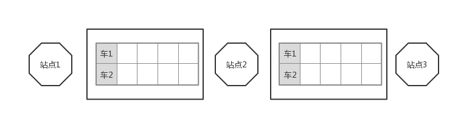
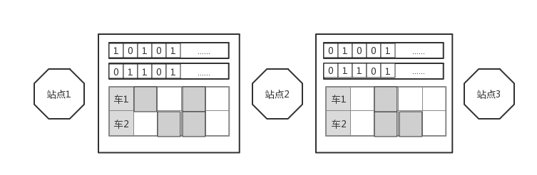

# 国科大并发数据结构与多核编程 -- 列车售票系统
---
## 目录
---
### 1. 基本结构的实现
### 2. 使用位图加速余票查询
### 3. 使用位图加速购票
### 4. 懒惰计算
### 5. 简单测试
---
### 1. 基本结构的实现
接下来叙述的实现均以下面的场景为例：
1. 一共有三个站台
2. 一共有两趟车
3. 每趟车两节车厢，每节车厢两个座位
在本系统的时间中，将上述的应用场景表示为下图中的形式：


如上图中所示，系统中会将三个站台之间的所有座位都表示出来，每一个车次使用一个单独的表示座位的数组表示，一共（2\*2\*2\*2）16个座位，由于购票时用户只需要指定出发站、终点站以及车次号，因此系统仅需区分不同车次的座位，而对同一车次中的不同车厢的座位同等对待，车次中的每一个座位可以表示为一个类，如下面的形式：
```Java
class Seat {
    private Lock lock;
    private boolean available;

    public Seat() {
    }

    public void lock() {
    }

    public void unlock() {
    }

    public boolean isAvailable() {
    }

    public void occupy() throws IllegalStateException {
    }

    public void free() throws IllegalStateException {
    }
}
```
每一个Seat实例都包含了一个锁以及一个表示是否为空闲（即可以购买）的布尔变量，同时还包含了加锁（lock）解锁（unlock）占用（occupy）释放（free）以及查询是否空闲（isAvailable）的方法。同时在实际实现时系统使用类`Section`管理一个区段中的所有座位，使用类`SectionRange`管理所有区段。

下面分别从购票，退票以及查询余票三个方面简单叙述这一基本结构的实现：

+ 购票

购票的时候用户会指定车次以及起始终止站的信息，而对于车厢号以及座位号系统可以随机分配，因此在刚开始售票的时候，系统可以在某一阈值次数之内采用随机分配的方式为本次调用产生车厢号以及座位号，当得到车厢号以及座位号后，本系统需要从起始站点开始，依次对站点之间对应的座位进行检查，即查询是否为空闲（isAvailable），一直到终止站点为止，如果这些座位均空闲，则进行加锁（lock），之后再一次检查是否空闲，若是，则进行占用（occupy），之后解锁（unlock），其中的任何一步失败则重新产生车厢号与座位号。如果随机购票次数超出了设定的阈值，则从最近的一次购票位置开始，遍历本车次所有的座位，直到购票成功，或者由于无票而返回。

+ 退票

由于购票时会检查目前的座位是否空闲，若不空闲的话便不会对座位的属性做出任何的修改，因此退票的过程可以在不加锁的情况下进行，直接将从起始站到终点站之间的对应座位释放（free）即可，仅针对退票这一功能的实现而言，其可以是wait-free的，但在实际的实现中，由于需要对退票进行验证，因此退票方法不是wait-free的。

+ 查询余票

查询余票采用简单的遍历的方式，即挨个访问某一车次某一行车区间的所有座位，并统计所有空闲的座位数量。

另外购票中还有一点值得注意，便是车票id的产生，实现的要求中需要所有的车票具有唯一的id号码，这里可以使用java`concurrent`包中的`AtomicLong`或者`AtomicInteger`即可，在本系统的实现中，采用了双调计数网络的方式产生车票的id号，实际的性能差异并未测试，但感觉上来说采用`AtomicLong`之类的应该足够了。

**优缺点** 采用上述实现方式的优缺点比较明显，由于将所有的座位相互独立开，因此不同线程在购买不同的座位时不会有冲突发生，减少了争用，同时退票比较简单，坏处就是购票过程更加繁琐，并且当多次随机购票失败后需要遍历购票，效率低，同时目前查询余票的方式效率也比较低。

---
### 2. 使用位图加速余票查询
由于之前使用的查询余票的方式比较笨拙，因此考虑采用位图的形式来加速余票查询，简单来说就是使用一个或多个`long`类型（当然也可以使用`int`或者`byte`）的变量来记录某一车次在某一区段的售票情况，初始情况下，位图变量的所有位均为0，当某车次某一区间的某一座位售出后，属于该车次区间的位图变量的对应位置就会置1，因此现在的购票过程变为了两步，第一步是将车次的座位设置为占用，第二步是设置该车次在本区间的位图变量。采用这样的方式，当需要查询某车次在某一个区间还有多少余票的时候，只需要将该车次需查询区间的所有位图变量取出，将这些变量按位或在一起，并统计最终结果中0的个数便可以得到该区间的余票数量。依然以上一节中的场景为例，加入了位图变量之后的情形如下所示：

任意车次的所有区间都增加了一个用于表示车票售卖情况的变量，由于每个车次的座位数量只有4个，因此每个车次只需要一个`long`类型的变量便可以表示，且每个变量只有前4位有效，之后的二进制位全部被置为1，防止在计算的时候出现错误的空闲座位。

使用按位或的方法得到最终的结果之后，可以使用以下的算法快速地统计结果二进制中0的个数
```Java
public static int countZeros(long l) {
        return countOnes(~l);
}

public static int countOnes(long l) {
        int count = 0;
        while (l != 0) {
            l = l & (l - 1);
            ++count;
        }
        return count;
}
```
算法的分析说明详见[二进制中1的个数](https://www.cnblogs.com/edisonchou/p/4752086.html)。使用位图来加速查询的过程还有一些需要考虑的因素，当多个线程购买的车票在位图的表示中仅集中在同一个位图变量中时，可能会出现多个线程同时设置该变量的情况，这样会导致争用，使用较短长度的类型变量可以缓解该问题，例如使用`int`而不是`long`，但是这样会导致位图变量的数量增加，可能会降低查询的效率，考虑到测试时购票的频率是小于查询的频率的，因此应该偏向于使用较长位数的类型。

---
### 3. 使用位图加速购票
实际上位图的信息不仅可以用于加速余票的查询，也可以用于定位空闲车票的位置，当使用按位或的方法得到位图变量的结果之后，通过定位结果中二进制位为0的位置，可以反向推得可能空闲的车票的位置，因此购票的方法在经过随机购票之后，可以利用位图信息快速获得余票的位置，而不是采用之前所述的遍历的方式进行尝试。这样的加速方式并不影响购票的正确性。

定位二进制位中0的位置的算法与之前统计0的个数的算法较为类似：
```Java
public static List<Integer> locateOnes(long l) {
        ArrayList<Integer> location = new ArrayList<>(longSize); // longSize == 64
        while (l != 0) {
            long tmp = l & (l - 1);
            location.add(locateMap.get(l ^ tmp));
            l = tmp;
        }
        return location;
}

public static List<Integer> locateZeros(long l) {
        return locateOnes(~l);
}
```
通过计算l与tmp之间的差值可以方便地计算出二进制中1的位置。

### 4. 懒惰计算
通过将查询得到的余票信息保存起来，当下一个查询调用到来时，如果查询区间[x,y]的任何自区间在这个时间段中没有任何的购票以及退票行为，则可以直接将保存的旧值返回，以达到加速的目的。懒惰计算适合于在整个调用过程中，查询余票的次数大于购票以及退票的次数，同时当一个车次的座位数以及总的车站数目不大的情况下，直接计算余票的数量效率也比较高，因此这种情况下使用懒惰计算并不会有很大的效率提升，如果实现得不当反而会降低查询的效率，因此是否使用懒惰计算应该根据实际情况而定。

在使用懒惰计算的情况下，系统查询余票的过程可以用如下的代码表示：
```Java
public int countAvailables(int route, int departure, int arrival) {
        boolean isChanged = false;
        isChanged = 子区间是否改变
        if (isChanged || 并未存储该区间余票数量) {
            availables = 计算余票数量
            hash.put(route, departure, arrival, availables);
        } else {
            availables = hash.get(route, departure, arrival);
        }
        return availables;
}
```
余票数量的存储以考虑使用hash表的方式，但需要注意的是普通的hash表并不能满足查询余票静态一致性的要求，需要为hash中存储的每一个元素增加一个时间戳的信息，时间戳单调递增，这样才能满足需求。为了最大限度提高执行效率，本系统针对查询的场景实现了一个简单的hash结构：
```Java
public class LocalHashMap {
    private AtomicStampedInteger[] record;
    ...

    public LocalHashMap(int route, int stationNum) {
    }

    public boolean containsKey(int route, int departure, int arrival) {
    }

    public void put(int route, int departure, int arrival, int value) {
    }

    public int get(int route, int departure, int arrival) {
    }
}
```
本结构只提供了一些必须的方法，同时最主要的成员是一个`AtomicStampedInteger`类型的数组，该数组在初始化时被初始化的长度为所有可能的查询区段的总和，例如若共有10个车站，则所有可能的查询组合共有1+2+...+9=45个，则record变量的初始长度为45。不同的区段在数组中具体位置的计算需要一些处理，在此不赘述。类型`AtomicStampedInteger`实际上是对类型`AtomicStampedReference<Integer>`的包装：
```Java
class AtomicStampedInteger {
        private AtomicStampedReference<Integer> item;

        public AtomicStampedInteger(int initInteger, int initStamp) {
            item = new AtomicStampedReference<Integer>(initInteger, initStamp);
        }

        public boolean compareAndSet(int expectedInteger, int newInteger, int expectedStamp, int newStamp) {
            return item.compareAndSet(expectedInteger, newInteger, expectedStamp, newStamp);
        }

        public int getInteger() {
            return item.getReference();
        }

        public int get(int[] stampHolder) {
            return item.get(stampHolder);
        }
}
```
---

### 5. 简单测试
**测试硬件平台**

**CPU**：I7-8750H

**Mem**: 16G

**测试参数**

| 车次数 | 车厢数 | 座位数 | 站数 |
| ------ | ------ | ------ | ---- |
| 5      | 8      | 100    | 10  |

测试线程数量为4，8，16，32，64，每个线程调用方法总数为20000次

| ThreadNum: | 购票平均时间(ns): | 退票平均时间(ns): | 查询平均时间(ns): | 吞吐量(t/s): |
|------------|-----------------|--------------------|---------------------|------------------|
| 4          | 10956           | 2785               | 1473                | 733000           |
| 8          | 6926            | 2095               | 786                 | 2191000          |
| 16         | 10885           | 2800               | 1003                | 2388000          |
| 32         | 9392            | 1237               | 1123                | 2782000          |
| 64         | 32308           | 1663               | 1935                | 3605000          |